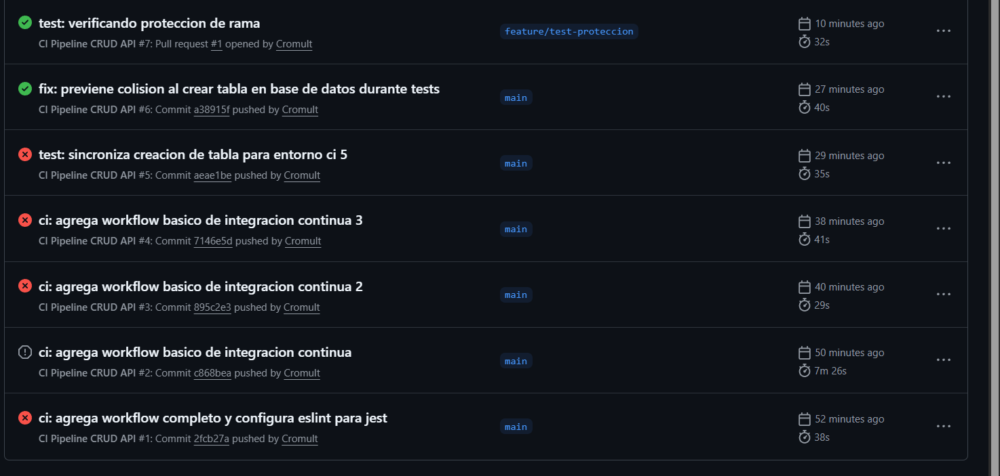
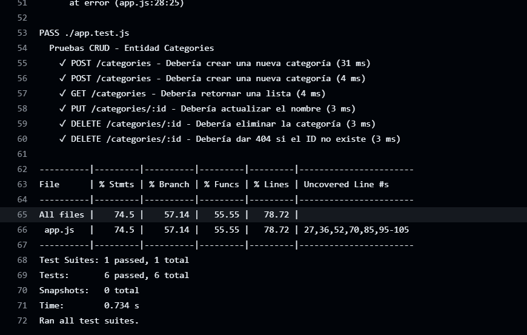
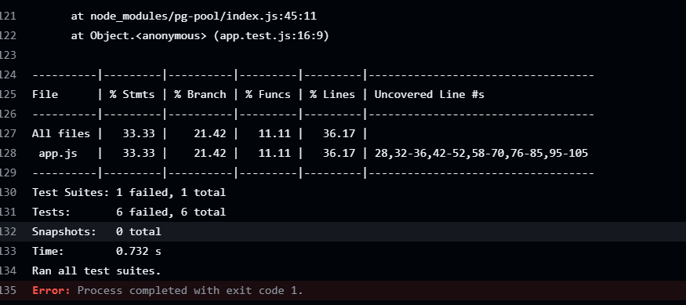
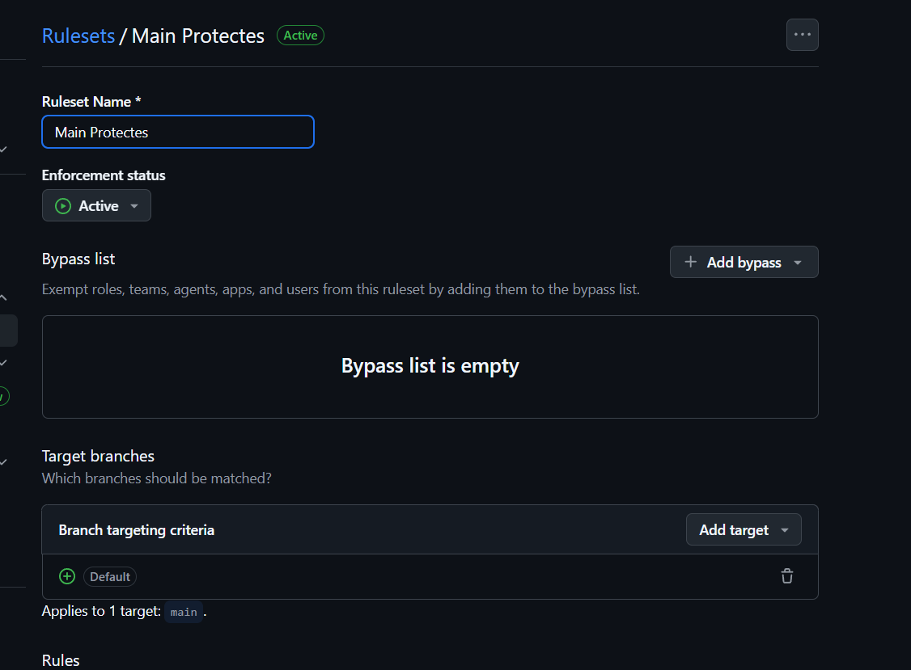
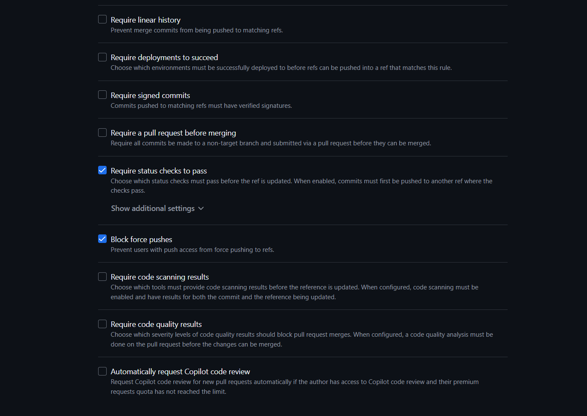
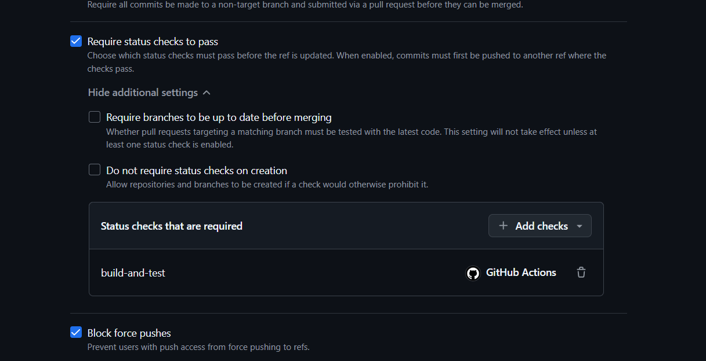

# Informe de Laboratorio: Implementación de Integración Continua (CI)

**Estudiante:** Pablo Lopez Chavez
**Carrera:** Ingeniería de Sistemas / Software
**Proyecto:** API CRUD de Categorías (Node.js + PostgreSQL)

---

## 1. Descripción del Proyecto

Este proyecto consiste en una **API REST** desarrollada con **Node.js** y el framework **Express**. La aplicación gestiona una entidad de dominio llamada "Categories" permitiendo realizar operaciones CRUD (Create, Read, Update, Delete) sobre una base de datos **PostgreSQL**.

### Tecnologías utilizadas:

* **Backend:** Node.js, Express.
* **Base de Datos:** PostgreSQL (Dockerizada para entorno local y de CI).
* **Pruebas:** Jest y Supertest para pruebas de integración.
* **Calidad de Código:** ESLint (Análisis estático).
* **Automatización:** GitHub Actions.

## 2. Descripción del Pipeline Configurado

El workflow de Integración Continua (`ci.yml`) automatiza la validación del código en cada `push` o `pull_request` hacia la rama `main`. El pipeline realiza los siguientes pasos:

1. **Provisionamiento de Servicios:** Levanta un contenedor de PostgreSQL 15-alpine con credenciales de prueba.
2. **Checkout:** Descarga el código fuente en el runner de GitHub.
3. **Setup de Entorno:** Configura Node.js v20 y gestiona el caché de dependencias.
4. **Instalación:** Ejecuta `npm ci` para una instalación limpia y determinista.
5. **Análisis Estático (Linting):** Ejecuta ESLint para asegurar que el código cumpla con las reglas de estilo y evitar errores comunes.
6. **Pruebas e Integración:** Ejecuta las pruebas contra la base de datos real y genera un reporte de cobertura detallado.
7. **Carga de Artefactos:** Sube el reporte de cobertura (`coverage/`) como un artefacto descargable.

---

## 3. Evidencias del Laboratorio

### A. Historial de Ejecuciones (Pestaña Actions)

Muestra la lista de ejecuciones del workflow, confirmando la estabilidad del pipeline a lo largo del desarrollo.

### B. Detalle de Workflow Exitoso y Cobertura

Captura del log donde se observa el paso de las 6 pruebas unitarias/integrales y la tabla de cobertura de código generada por Jest.

### C. Detalle de Workflow Fallido (Fallo Intencional)

Se forzó un error en el código (o en las pruebas) para verificar que el pipeline detiene el proceso de integración ante fallos de lógica o estilo.

### D. Configuración de la Regla de Protección de Rama

Captura de la configuración del **Ruleset** en GitHub, donde se exige que el check `build-and-test` pase obligatoriamente antes de permitir un merge en la rama `main`.

---

## 4. Conclusiones y Reflexión

La implementación de un pipeline de **Integración Continua (CI)** en este proyecto ha demostrado ser una herramienta fundamental para el desarrollo moderno. Las principales conclusiones son:

* **Detección Temprana de Errores:** El uso de pruebas automáticas y linting previene que errores de sintaxis o fallos en la lógica del CRUD lleguen a la rama principal.
* **Confiabilidad:** Al integrar una base de datos real en el CI mediante *Service Containers*, las pruebas de integración son mucho más fieles a lo que sucederá en producción.
* **Seguridad en Colaboración:** Las reglas de protección de rama aseguran que, incluso en equipos grandes, ningún cambio sea fusionado sin antes haber sido validado por el pipeline.
* **Automatización de Calidad:** La generación automática de reportes de cobertura permite monitorear qué partes del código necesitan más atención, fomentando la creación de software más robusto.

En conclusión, CI no es solo un paso extra, sino un estándar de calidad que ahorra tiempo de depuración y garantiza la entrega de software funcional y mantenible.
