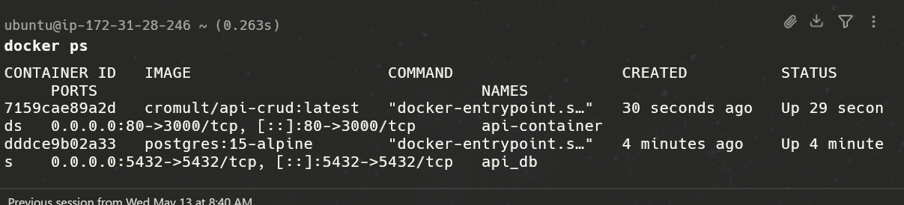

# Informe de Laboratorio: Pipeline de Despliegue Continuo (CD) con Docker y AWS

**Estudiante:** Pablo Lopez Chavez

**Institución:** Universidad de San Francisco Xavier de Chuquisaca (USFX)

**Proyecto:** API CRUD de Categorías con Despliegue Automatizado

**IP Pública de la Instancia:** `3.80.110.16`

**Enlace del repo**: https://github.com/Cromult/github-actions-ci-demo-PLC.git

---

## 1. Descripción del Pipeline y Decisiones Técnicas

El pipeline de CD ha sido diseñado para automatizar el ciclo de vida del software desde el commit hasta la ejecución en producción. Se implementaron las siguientes decisiones técnicas:

* **Multi-stage Docker Build:** Se utilizó una construcción en dos etapas (builder y production) para generar una imagen final basada en `node:alpine`. Esto reduce drásticamente el tamaño de la imagen y mejora la seguridad al no incluir herramientas de compilación en el entorno de ejecución.
* **Gestión de Redes en Docker:** Se configuró una **User-defined Bridge Network** en la instancia EC2. Esta decisión permite que la API y la base de datos se comuniquen de forma privada mediante resolución de nombres por DNS interno (`api_db`), eliminando la necesidad de exponer puertos sensibles al exterior.
* **Etiquetado por SHA:** Cada imagen subida a Docker Hub incluye el  **SHA del commit** . Esto garantiza la trazabilidad inequivoca entre el código fuente y el contenedor desplegado.
* **GitHub Environments:** Se configuró el entorno `production` para centralizar las llaves SSH y las IPs de infraestructura, permitiendo una gestión de secretos más organizada y profesional.

---

## 2. Evidencias del Workflow (GitHub Actions)

### Fase A: Historial de Ejecución y Jobs

Captura de la pestaña Actions donde se visualiza el flujo completo con los dos jobs (`build-and-push` y `deploy`) en verde.

### Fase B: Escaneo de Vulnerabilidades (Trivy)

Evidencia del análisis de seguridad proactivo realizado sobre la imagen generada.

### Fase C: Despliegue en EC2 vía SSH

Captura que demuestra la conexión exitosa y la ejecución de comandos remotos en el servidor de AWS.

---

## 3. Evidencia de la Aplicación en Producción

### Aplicación funcionando (IP Pública)

Prueba de acceso a la API desde un navegador externo utilizando la dirección IP de la instancia remota.

### Estado de los Contenedores en el Servidor

Verificación interna mediante la terminal de Ubuntu en AWS.

> **[INSERTAR AQUÍ: Captura de tu terminal SSH ejecutando el comando `docker ps`, donde se vean listados tanto `api-container` como `api_db`]**

## 4. Estrategia de Rollback

En caso de detectar un error crítico en producción, el proceso de reversión se realizaría de la siguiente manera:

1. **Identificación:** Localizar en Docker Hub el tag correspondiente al SHA del último commit estable conocido.
2. **Ejecución Manual:** Conectarse vía SSH a la instancia EC2 y ejecutar el comando de despliegue apuntando específicamente a ese tag:
   `docker run -d --name api-container ... cromult/api-crud:[SHA_ESTABLE]`
3. **Corrección en el Pipeline:** Realizar un `git revert` del commit defectuoso en la rama `main` para que el pipeline de CD despliegue automáticamente la versión corregida.

---

## 6. Reflexión sobre Contenedores y CD en Proyectos Reales

El uso de contenedores y despliegue continuo aporta ventajas competitivas innegables:

* **Portabilidad:** La frase "en mi máquina funciona" desaparece; la aplicación se comporta igual en el runner de GitHub que en la instancia de AWS.
* **Velocidad de Respuesta:** Para un líder de proyecto, la capacidad de desplegar parches de seguridad o nuevas funcionalidades en minutos, sin intervención manual, reduce el tiempo de comercialización (Time-to-Market).
* **Escalabilidad:** Contenedores aislados facilitan la transición futura hacia orquestadores como Kubernetes si la demanda del sistema aumenta.repositorio
* https://github.com/Cromult/github-actions-ci-demo-PLC.git
